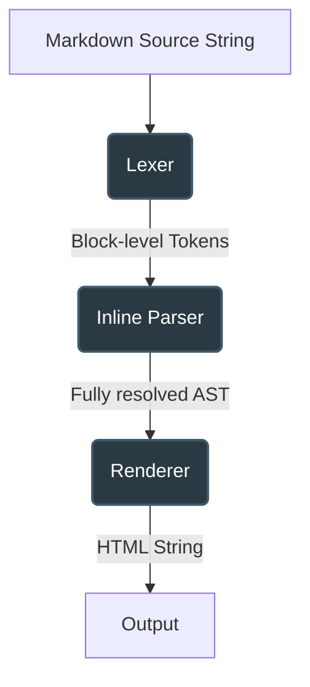
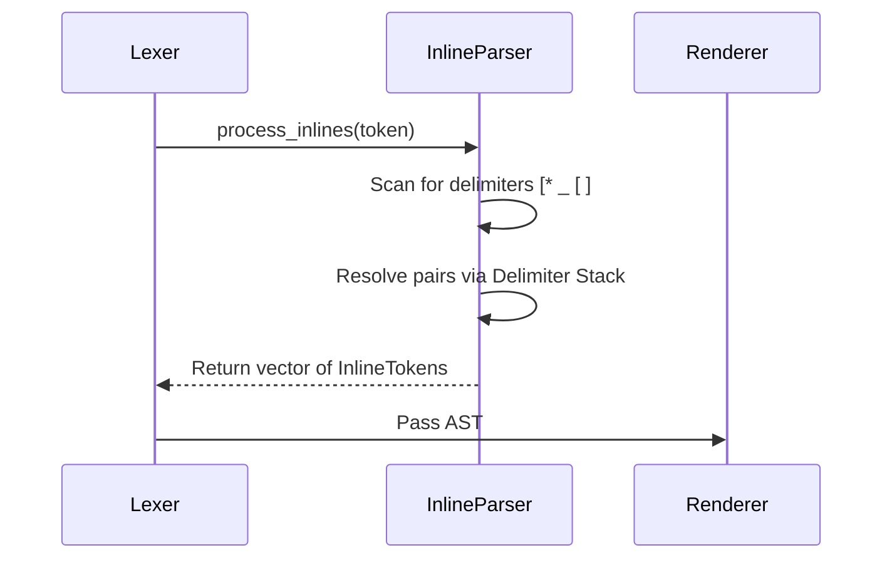

# marked-rs Architecture

`marked-rs` is designed as a direct port of the JavaScript `marked` library, translating its highly optimized regular expression architecture into zero-unsafe Rust.

## Pipeline Overview

The markdown parsing process is split into three distinct phases:

### 1. Lexer (Block-level Parsing)
The `Lexer` breaks the raw text into a sequence of block-level tokens (e.g. Paragraphs, Headings, Lists, Blockquotes). At this stage, inline content (like emphasis or links) remains as raw strings. 
The lexer handles complex block semantics such as list indentation rules and HTML blocks.

### 2. Inline Parser (Delimiter Stack)
Unlike `marked.js` which uses catastrophic monolithic regexes for emphasis, `marked-rs` uses a CommonMark §6.2 compliant **Delimiter Stack** to resolve emphasis, strong emphasis, and links without backtracking.

### 3. Renderer (HTML Generation)
The `HtmlRenderer` is responsible for serializing the AST into standard HTML. It correctly handles context-aware escaping (like `encode_email` and `encode_href`) to ensure XSS vectors are mitigated before the HTML string is constructed.
